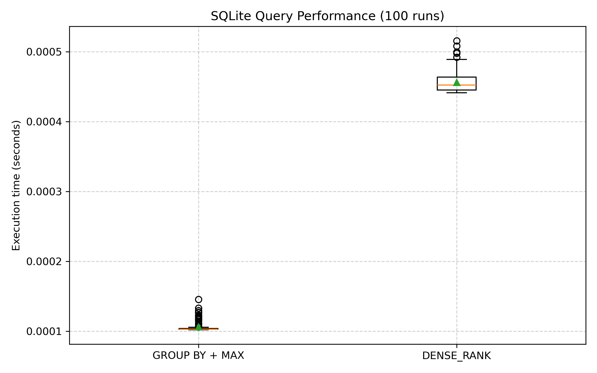

# SQLite `GROUP BY` vs `DENSE_RANK`

Simple benchmark of SQLite3 using Python to test comparable queries for a test case

## How to run

1. Make sure that you have uv installed.
2. After installing it, run `uv run main.py`.
3. Next, run `uv run bench.py`.
4. To view the results, open up the benchmark_results.png image to see the box and whisker plot.

Here is an example:

You can change the executing code in `bench.py` to test different configurations of the query.
